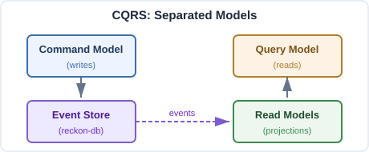

# Why Event Sourcing {#sec-why}

A customer support agent gets a complaint. *I was charged twice for the same order.* The agent pulls up the customer's account. The current balance is clean: one order, one charge of \$19.99, one fulfilment. The numbers add up; the agent tells the customer they must be mistaken.

The customer was not mistaken. At 10:03:14 AM, the customer's card was charged \$19.99 for the order. At 10:03:51 AM, the customer's card was charged \$19.99 again (a network retry that the upstream system did not deduplicate). At 10:03:52 AM, the company's billing system detected the duplicate and immediately issued a \$19.99 refund. The customer's bank statement shows two charges and one refund. The company's database shows one charge.

The two views are both correct. The bank's statement records *what happened over time*. The company's database records *what is true right now*. They disagree because they answer different questions, and most enterprise software is built to answer only the second.

This chapter is about why building software that can also answer the first (*what happened, in what order, with what consequences*) is worth the trouble. The trouble is real; the chapter is also honest about where event sourcing is wrong. By its end, the reader should know whether to read the rest of the book.

## The lie of "current state"

Most software treats *the current state of the world* as a primary fact. The user's name is "Alice"; the order is "shipped"; the loan is "open". These facts live in database rows and are mutated by the application as life happens. *Alice gets married and changes her name; UPDATE users SET name = 'Alice Wang' WHERE id = 42.* The row's content is replaced. The previous content is gone.

The replacement is a lie. The previous content existed; the company *did know Alice as "Alice Smith"* for the seven years before her marriage; that knowledge was useful (for fraud detection, for analytics, for warm-and-fuzzy "remember when" emails on her tenth anniversary as a customer). The UPDATE makes the knowledge unrecoverable. The lie is not that the new state is wrong (it is correct) but that *only the new state exists*. The history has been silently destroyed.

For many applications, destroying history is fine. A shopping cart's "current contents" matter; the history of every item the customer added and then removed before checkout does not. A web session's "currently logged in?" matters; the history of every login and logout does not. There are vast categories of data where the present is the only fact worth keeping, and event-sourcing those applications is a misapplication of the discipline.

For other applications, destroying history is *malpractice*. A bank account that does not record every transaction cannot reconcile against its counterparties. A medical record that does not record every observation, dosage, and change of dosage cannot inform treatment decisions over time. A logistics system that does not record every package handoff cannot diagnose where a shipment went wrong. An order-management system that does not record every charge cannot answer "was this customer charged twice?".

The first kind of system (*present-only* applications) can use state-update databases happily and the Codex has no quarrel with them. The second kind (*history-load-bearing* applications) needs event sourcing, and the rest of this book is about how to build them.

## The append-only log

The architectural turn is small and consequential.

In a state-update system, the database holds *the current state*. Operations write directly into that state; previous state is overwritten.

In an event-sourced system, the database holds *the sequence of events*. Operations write *new events appended to the sequence*; previous events are never overwritten. The current state is *derived* by folding the sequence; reading the events in order and accumulating their effects.

```
state-update system:           event-sourced system:

       INSERT                          APPEND
       UPDATE                          APPEND
       UPDATE                          APPEND
       DELETE                          APPEND   (a "deleted" event)
         │                                │
         ▼                                ▼
  ┌─────────────┐                  ┌─────────────┐
  │ current row │                  │ event log   │
  └─────────────┘                  └─────────────┘
   (one record,                       (many records,
    last write wins)                   none overwritten)
```

The trade is visible. The state-update system stores one row; the event-sourced system stores all the events. Storage costs more. Query "what is the current name?" requires the event-sourced system to fold all the events; reads cost more.

The trade buys: a record. A *complete*, *immutable*, *replayable* record of what happened. The customer's complaint about duplicate charges can be answered by reading the events: at 10:03:14 a charge, at 10:03:51 another charge, at 10:03:52 a refund. The system's current state is *consistent with the bank statement* because both are derived from the same events. There is no version of "what happened" that the system does not know.

The append-only log is the primary storage. Every other view (read-models, search indexes, analytics warehouses) is *derived from the log*. The log is the truth; the views are services.

This is the cardinal architectural commitment of event sourcing: **state is a derived quantity; events are the primary record**. From this commitment everything else in this book follows.

## CQRS as a consequence

If the events are the primary record, and views over them are derived, then *the write side and the read side need different machinery*.

The write side accepts commands, validates them against current state (which the write side rebuilds from events as needed), and appends new events. The write side's main job is *defending invariants*; ensuring that no event reaches the log that would violate the system's rules. *No more than five open loans per Borrower; no negative balance; no order shipped before payment cleared.* These checks are local to a Dossier (see @sec-d5) and inexpensive when the Dossier's state is rebuilt from its own short stream.

The read side accepts queries, looks up answers in *read-models* (tables, indexes, caches), and returns results. The read side's main job is being *fast and shaped right*. *List my overdue loans; show me the top ten books by checkout count; count active members by branch.* These queries do not run against the event log directly; folding the entire log on every query would be too slow. Instead, projections subscribe to events and continuously materialise read-models that answer the queries quickly.

This split (write side that defends invariants by writing events, read side that serves queries from materialised views) is **Command Query Responsibility Segregation** [@young2010cqrs]. Greg Young articulated it in 2010 as a near-corollary of event sourcing. The two are usually deployed together; the Codex treats them as one architectural commitment under the names CMD (write side), PRJ (projection side), QRY (query side); the three Departments of @sec-pizza.

{#fig-cqrs width="75%"}

CQRS gets one objection often enough to address up front:

::: {.callout-note}
## Counterclaim and response

**Counterclaim:** *I do not need event sourcing. I can do CQRS without it; just split the write side from the read side and use ordinary SQL on both.*

**Response:** You can; many systems do; the architecture is real and useful. What it gives up, compared with event-sourced CQRS, is *the canonical log*. Without an event log, the write side and the read side share a current-state truth that is the database; if the read-model derives from the write-model via a synchronisation pipeline (CDC, dual writes, periodic ETL), the system pays for synchronisation complexity and has no replay story. Event-sourced CQRS replaces the synchronisation problem with the projection problem (which is just *fold the events to update the read-model*) and gains the replay property as a side effect. The Codex treats event sourcing and CQRS as one architectural commitment because most of the value comes from holding them together. Splitting them is fine; it produces a different system with different trade-offs; the rest of this book is not about that system.
:::

## Replay; the load-bearing claim

The argument for event sourcing reduces to one property. *Given the events, any view of history can be reconstructed.*

This is what *replay* means. Take the event log. Run it through a projection. Get a read-model. Throw the read-model away. Run the log again. Get the same read-model. Run the log through a *different* projection. Get a *different* read-model; one nobody had thought of when the events were originally written. The events do not care. They are the same events. New questions can be asked of them indefinitely.

The replay property has three corollaries that matter in practice.

**New views on old data are cheap.** A team realises six months into production that they need a new dashboard; "books by checkout frequency by month for the last year". In a state-update system, this dashboard either has its data already aggregated (lucky) or it does not (unlucky), and "unlucky" means waiting until enough data accumulates going forward. In an event-sourced system, the team writes a projection, runs it against the historical event log, and the dashboard works *immediately*, with twelve months of accurate history.

**Bugs are forensically diagnosable.** A read-model gets out of sync with reality; users see wrong data. In a state-update system, the team debugs by *guessing what should have happened*. In an event-sourced system, the team rebuilds the read-model from the events; if the rebuild produces the correct view, the bug is in the projection's incremental-update logic; if the rebuild produces the same wrong view, the bug is in the projection itself. Replay turns debugging from archaeology into a procedure.

**Audit is a query, not a project.** Regulated industries (financial services, healthcare, public infrastructure) pay enormous costs for audit. In a state-update system, audit requires either *change-data-capture infrastructure* (a parallel system that records what state-update systems would otherwise destroy) or *retention logs* (a parallel record that may diverge from the truth). In an event-sourced system, the events *are* the audit record; the only question is who is allowed to read them. The compliance cost moves from infrastructure to access control.

These corollaries together explain why event sourcing has overwhelming adoption in regulated industries and overwhelming non-adoption in places like simple CRUD applications. The value-per-event-stored is high when audit and forensics matter; low when they do not.

## Where event sourcing fits

The Codex's working rule of thumb: event sourcing fits when the *history of an entity is part of its identity*.

A Loan is its history. The Loan was issued; renewed twice; eventually returned. Asking "what is this Loan?" requires the full history; the "current state" is just the most recent fold. Audit, dispute resolution, and renewal-policy decisions all depend on the past, not just the present.

A Membership is its history. The Membership was opened, upgraded, suspended for non-payment, reinstated, expired. Loyalty programs, dispute resolution, and reactivation offers depend on what happened, not just on the current status.

An Order is its history. Placed, paid for, partially shipped, partially refunded, customer-service-escalated, finally completed. Inventory reconciliation, customer service, and fraud detection all need the timeline.

In each case the entity has *process-shape* (@sec-d5): it goes through phases, accumulates context, and its current state is best understood as a fold of its progress. These are Dossiers. Event sourcing fits naturally because the entity *already thinks in events*; recording them is honest about how the business itself models the thing.

Conversely, event sourcing fits less well when *the entity is a snapshot, not a process*:

- A *blog post*. It has a title, body, author. Edits replace the previous content. Nobody audits what version 3 of paragraph 2 said before version 4. Use a CMS with a database; the present is the only relevant state.
- A *configuration setting*. Database connection string. Feature flag. Threshold value. The current value is what matters; previous values are interesting only for change-history (which is a separate concern, often handled by a version-controlled config file rather than an event store).
- A *static catalogue*. A list of countries with ISO codes. A list of supported file formats. The data is read-only and the only "events" are infrequent administrative changes; the cost of event-sourcing this exceeds the value.

The discrimination is not about size or importance; it is about whether the past matters. A small system whose past matters benefits from event sourcing; a large system whose past does not matter does not.

## Where event sourcing does not fit

Be honest about the contraindications.

### Pure CRUD with no audit requirement

Some applications really are CRUD. The entity has a current state; the current state is all anyone cares about; nobody will ever ask "what did this look like a month ago?" Event-sourcing such a system pays for storage, projection plumbing, and conceptual overhead with no countervailing benefit. The discipline does not improve simple things; it improves complex things by giving them a coherent structure.

If a team is building a task-list app, a personal finance tracker, a simple blog, an internal admin panel (and the team is confident that nobody will need historical analysis) *do not use event sourcing*. The architectural overhead is real and unrewarded.

### Transactional ETL where the source is the truth

When the system sits in a data pipeline (*upstream sends us facts, we transform them, we ship them downstream*) event sourcing the middle layer can introduce confusion. The events the middle layer produces are not first-class facts about the world; they are intermediate processing states. The upstream's record is the truth; downstream's record will be the truth for its consumers. The middle layer is best modelled as a streaming transformation, not as an event-sourced system in its own right.

Some pipeline architectures do event-source the middle layer for replay-ability of the transformation logic. This is a defensible choice in specialised contexts (e.g., financial-trade enrichment where the transformation must be reproducible for compliance) but generally not the default.

### Throwaway data

Logs that age out after 30 days, click-stream events that accumulate too quickly to retain individually, telemetry samples that are aggregated and discarded. These workloads have a *fact-stream shape* superficially similar to event-sourced systems, but the events are not first-class facts; they are samples. Time-series databases, log-aggregation systems, and stream-processing frameworks fit better than event stores.

### Teams that cannot commit to the discipline

Event sourcing requires discipline. Aggregates must be pure (@sec-pipelines). Events must be versioned. Projections must be idempotent. Read models must be eventually consistent. Teams that cannot or will not maintain the discipline produce event-sourced systems with the costs of event sourcing and none of the benefits; the events accumulate, the projections drift, the replay property degrades, and the team blames the architecture rather than the discipline.

If a team is choosing between "event sourcing badly done" and "CRUD competently done", the latter is preferable. The book's discipline-cost is real. Teams should adopt event sourcing because they want what it offers, not because it is fashionable.

## The Codex's stance

With the case established, the Codex's specific commitments can be named.

**Process-centric, not data-centric.** The Codex's aggregates are Dossiers; process artefacts, not data shapes. A Dossier exists because there is a *process* worth recording (a Loan being borrowed, a Membership being maintained, an Order being fulfilled). This is the departure from classical DDD that @sec-dossiers covers in detail. The change clarifies why some aggregates work and others do not: process-shaped boundaries are stable; data-shaped boundaries shift.

**Single deployable boundary per Division.** Each Division is one cohesive piece of software with one release cycle and one technology stack. CMD, PRJ, and QRY are sibling Departments inside a Division; integration with *other* Divisions is via explicit events on a shared mesh (@sec-pipelines). This is more disciplined than the typical microservices stance (which fragments writes across many services and runs into distributed-transaction problems) and more cohesive than monoliths (which couple many bounded contexts in one deployable).

**Recursive: the building is itself event-sourced.** The work of *building software* is itself a process worth recording, and the Codex applies the architecture to itself. The Reckon Cycle (@sec-cycle) treats each build process (Planning, then Crafting) as a Dossier; transitions between them are events; the work shelves and resumes; the audit trail of *how the system came to be* is as available as the audit trail of what the system has done since.

**Decisions as the carved-out alternative to Dossiers.** A small but important set of invariants cannot be hosted in any Dossier; uniqueness checks, cross-cutting allocation, rate limits. The Codex provides the Decision pattern (@sec-dossiers) as a first-class alternative, not a workaround. Dossiers cover ~90%; Decisions cover most of the rest; the architecture has explicit shapes for both.

**Names that scream.** The architecture is documentation only when its names announce what each piece does (@sec-screaming). This is non-negotiable. A codebase that follows every other commitment of this book but names its slices `LoanService` and `LoanHandler` is a codebase whose audit trail is real and whose navigability is fictional.

These commitments together produce an architecture that records what happened, audits cleanly, scales by team and deployment, refactors without rewriting, and tells its readers what it is for through its structure. The book's remaining chapters are about how to live these commitments.

## What follows

@sec-d5 establishes the vocabulary of containers (Domain, Division, Department, Desk, Dossier) that every later chapter depends on. Read it next.

@sec-pizza describes the structural shape of a Division: the inverted-architecture family from Palermo through Martin, plus the orthogonal vertical slicing that completes the picture.

@sec-screaming makes the naming discipline concrete.

@sec-dossiers gives the two consistency primitives: stream-version concurrency (Dossier) and tag-filter concurrency (Decision).

@sec-pipelines covers cross-entity and cross-Division coordination without sagas.

@sec-cycle ascends from the system being built to the cycle that builds it.

By the end of Part I, the *why* and the *what* are in place. Part II is the *how*: the libraries (*reckon-db*, *evoq*, *reckon-gateway*, *reckon-proto*) that turn the commitments into running software. A worked library example in @sec-library shows the whole architecture in operation.

Forty thousand words from here, the system the book describes will be one the reader could build. The next chapter starts the path.
